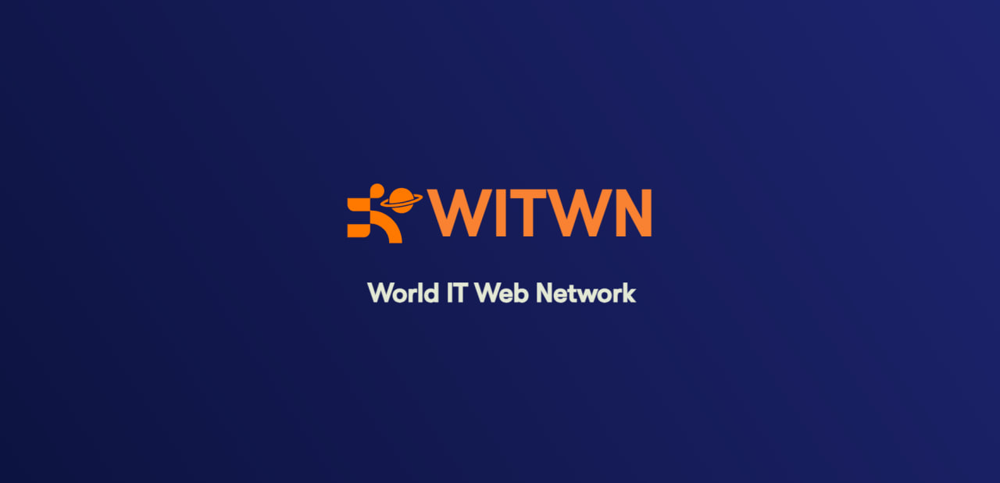
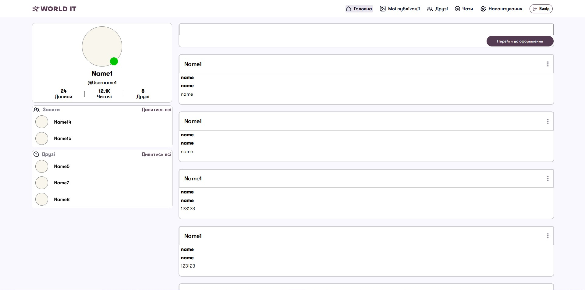
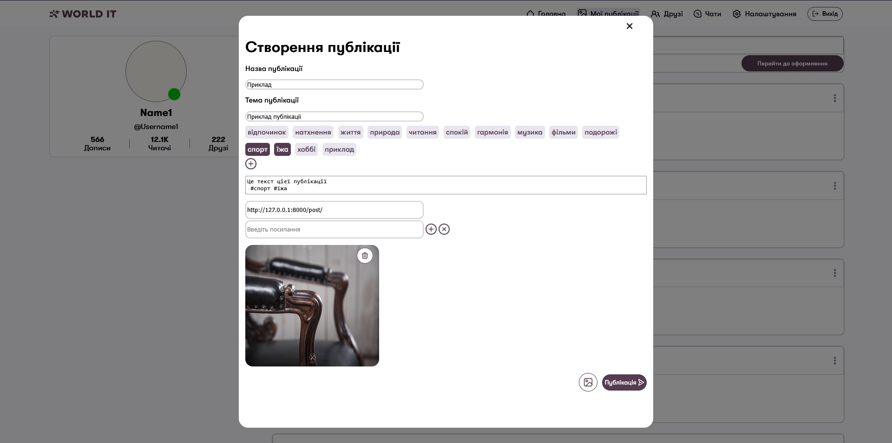
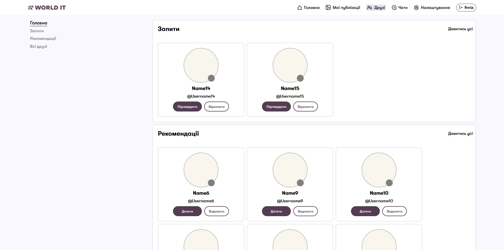
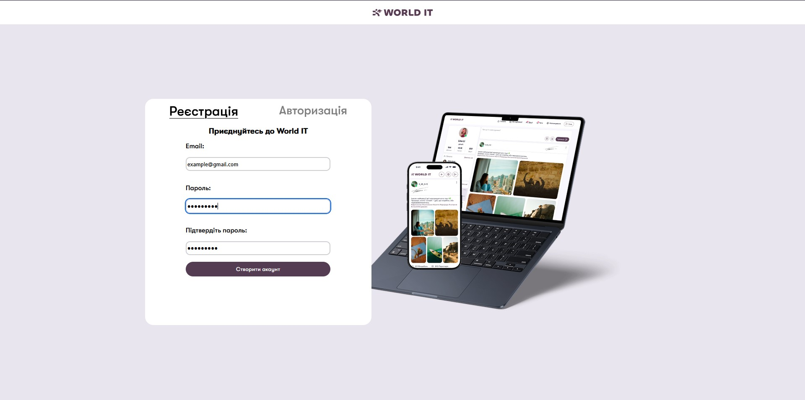
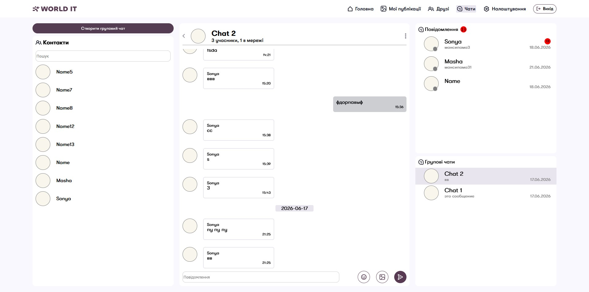
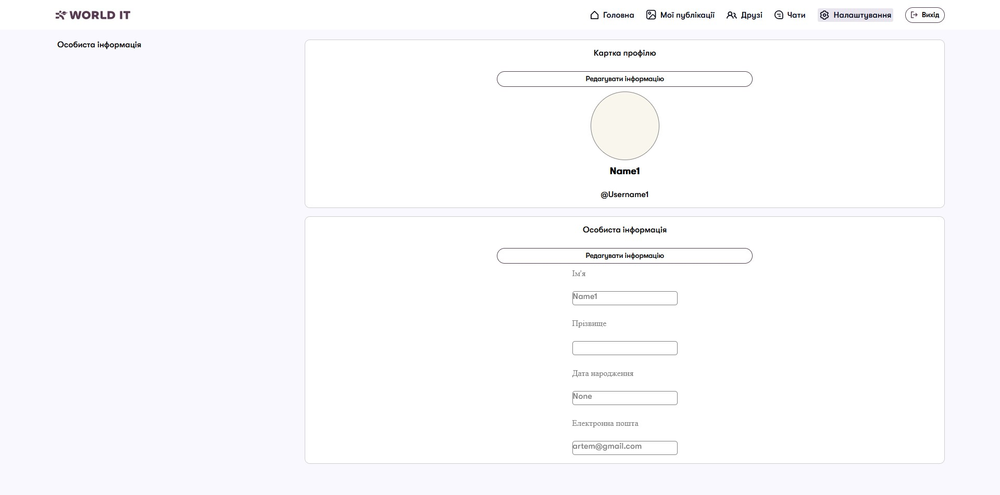

# World IT Web Network - Соціальна мережа



---

## Навігація по файлу / File navigation

- [Мета проекту / Project goal](#мета-розробки-цього-додатку)
- [Склад команди / Team lineup](#склад-команди)
- [Технології проекта / Project technologies](#технології-проекту)
- [Інструкції по роботі / Work instructions](#інструкції-по-запуску-проекту)
- [Все про додатків / All about apps](#додатки)
- [Висновок з роботи / Conclusion from the work ](#висновок-роботи)

---
## <a id="мета-розробки-цього-додатку">Мета розробки цього додатку / The purpose of developing this app :</a>
Даний проєкт створений для того, щоб користувачі могли без обмежень обмінюватися інформацією — зображеннями, текстами та іншими даними. / This project was created so that users can share information without any restrictions — images, texts, and other data.

Для тих, хто планує розгортання цього рішення, проєкт може бути цікавим завдяки потенціалу масштабування та можливостям монетизації. 
/ For those planning to deploy this solution, the project might be interesting because of its scaling potential and monetization opportunities.

Для нас як розробників це була практична робота з новими технологіями, а також спосіб закріпити знання у сфері веброзробки. / For us as developers, it was practical work with new technologies, as well as a way to solidify our knowledge in web development.

---

## <a id="склад-команди">Склад команди:</a>
* [Артем Демченко](https://github.com/ArtemDema) - Тімлід
* [Софія Семічевська](https://github.com/SonyaSemichevskaa)
* [Марія Бібік](https://github.com/MariaBibik085)

---

## <a id="технології-проекту">Технології проекта / project technologies:</a>
### Python
#### Головна мова програмування у проекті – Відповідає повністю за бекенд. / The main programming language in the project – Fully responsible for the backend.
1. Django - фреймворк для бекенд-розробки. У проєкті відповідає за рендеринг сторінок, створення API-ендпоінтів та взаємодію з базою даних. / A framework for backend development. In the project, it handles page rendering, creating API endpoints, and interacting with the database.
2. Pillow (PIL) - бібліотека для обробки медіафайлів користувачів. / a library for processing users' media files.
3. channels - модуль для реалізації асинхронних вебсокет-з’єднань на стороні бекенду. / a module for implementing asynchronous WebSocket connections on the backend.
4. daphne - сервер, що забезпечує асинхронну роботу Django. / a server that provides asynchronous operation for Django.
### SQL
#### Мова для роботи з реляційними базами даних, інтегрована з Django ORM. / A language for working with relational databases, integrated with Django ORM.
### HTML
#### Використовується для створення структури вебсторінок. Контент частково формується через Django-шаблони та JavaScript. / It is used to create the structure of web pages. The content is partly generated through Django templates and JavaScript.
### CSS
#### Відповідає за стилізацію вебсторінок. / Responsible for styling web pages.
### JS
#### Забезпечує інтерактивність на стороні клієнта (відкриття форм, робота вебсокетів, пінги тощо). / Provides client-side interactivity (opening forms, working with websockets, pings, etc.).
### Git
#### Система контролю версій, що використовувалась для командної розробки. / A version control system that was used for team development.
### Figma
#### Інструмент для створення дизайну інтерфейсів та планування структури проєкту. / A tool for creating interface designs and planning the project structure.

---

## <a id="інструкції-по-запуску-проекту">Інструкції по запуску проекту / Project Startup Instructions:</a>

### Як запустити проект ЛОКАЛЬНО / How to run the project LOCALLY

1. >Переконайтесь, що встановлено Python 3.10+ та pip / Make sure Python 3.10+ and pip are installed
2. >Завантажте проєкт, натиснувши кнопку "<> Code" → "Download ZIP" / Download the project by clicking the "<> Code" → "Download ZIP" button
3. >Розпакуйте архів у зручну папку / Unpack the archive into a convenient folder
4. >Відкрийте термінал у директорії проєкту та перейдіть у неї через cd / Open the terminal in the project directory and navigate to it using cd
5. >У папці socialmessanger виконайте / In the socialmessanger folder, run:
```bash
    pip install -f requirements.txt
    # Це встановить всі залежності у проекта / This will install all the dependencies in the project
```
6. >Перейдіть у директорію, де знаходиться manage.py (за допомогою команди "cd") / Go to the directory where manage.py is located (using the 'cd' command)
7. >Створіть та застосуйте міграції / Create and apply migrations:
```bash
    python manage.py makemigrations
    # Це створить міграції для бази даних. / This will create migrations for the database.
    
    python manage.py migrate
    # Це проведе міграції бази даних - створить всі моделі проекту та зробе його базу даних працюючою / This will run the database migrations - it will create all the project models and make its database work
```   
8. >Запустість проект / Project abandonment:
```bash
    python manage.py runserver
    # Це запустить проект локально / This will run the project locally
```

---

## <a id="додатки">Додатки / Apps:</a>
    admin.py - Відповідає за реєстрацію та налаштування моделей у адмін-панелі / Responsible for registering and setting up models in the admin panel

    apps.py - Містить конфігурацію Django-додатку / Contains the configuration of a Django app

    models.py - Описує структуру бази даних (таблиці та зв’язки) / Describes the database structure (tables and relationships)

    urls.py - Визначає маршрути та зв’язує їх з обробниками / Defines routes and links them to handlers

    forms.py - Відповідає за створення та валідацію форм / Responsible for creating and validating forms

    consumers.py - Реалізує WebSocket-класи для постійного зв’язку з клієнтом / Implements WebSocket classes for persistent communication with the client

    routing.py - Описує маршрути для WebSocket-з’єднань / Describes routes for WebSocket connections

    views.py - Містить логіку обробки HTTP-запитів і формування відповідей / Contains the logic for processing HTTP requests and generating responses

    templates - Папка з HTML-шаблонами сторінок / Folder with HTML page templates

        *.html - Шаблони вебсторінок / Web page templates


project - Папка з основною конфігурацією проєкту / Folder with the main project configuration

    asgi.py - Налаштування асинхронної роботи (WebSocket, ASGI) / Setting up asynchronous work (WebSocket, ASGI)

    settings.py - Основні налаштування Django проєкту / Basic Django project settings

    urls.py - Глобальні маршрути сайту та медіафайлів / Global site and media routes

    wsgi.py - Синхронний інтерфейс для запуску Django / Synchronous interface for running Django


static - Папка зі статичними файлами (JS/CSS/зображення) / Folder with static files (JS/CSS/images)

    *_app - Статичні файли конкретного додатку / Application-specific static files

        js - JavaScript-скрипти / JavaScript scripts

            script.js - Основний скрипт / The main script

        css - стилі / styles

            styles.css - Основні стилі / Basic styles

        images - статичні зображення сайту / static images of the site

        fonts - шрифти / fonts

            *.ttf - файли шрифтів / font files


media - Папка для збереження файлів, завантажених користувачами. Файли мають унікальні імена для уникнення конфліктів. / A folder for storing files uploaded by users. Files have unique names to avoid conflicts.

manage.py - Основний файл для керування Django-проєктом / The main file for managing a Django project

README.md - Поточний файл з описом проєкту / Current project description file

requirements.txt - Список залежностей для встановлення / List of dependencies to install

.gitignore - Перелік файлів і папок, які ігноруються Git / List of files and folders ignored by Git

### Home_app
- Відповідає за головну сторінку / Responsible for the main page
- Тут користувач може переглядати стрічку постів, свої пости, а також бачити запити в друзі та повідомлення / Here the user can view the post feed, their posts, and also see friend requests and messages.
- У розділі власних постів відображаються тільки власні публікації для зручного керування / The own posts section displays only your own publications for easy management


### Post_app 
- Відповідає за сторінку «Мої публікації» / Responsible for the "My Publications" page
- Дозволяє переглядати та керувати власними постами / Allows you to view and manage your own posts


### Friends_app
- Реалізує систему друзів: запити, список друзів та рекомендації / Implements a friends system: requests, friends list and recommendations
- Дозволяє фільтрувати користувачів за категоріями: друзі, запити, рекомендації / Allows you to filter users by categories: friends, requests, recommendations


### User_app
- Відповідає за реєстрацію, авторизацію та профіль користувача / Responsible for registration, authorization and user profile
- Після реєстрації надсилається підтвердження на email, що обмежує один акаунт на одну пошту / After registration, a confirmation email is sent, limiting one account to one email address.


### Chat_app
- Реалізує чат-систему в реальному часі / Implements a real-time chat system
- Дозволяє обмінюватися текстом та зображеннями / Allows you to share text and images
- Підтримує групові чати з керуванням адміністратора / Supports group chats with admin control
- Адмін може змінювати налаштування групи, додавати/видаляти учасників та видаляти групу / Admin can change group settings, add/remove members, and delete the group
- Уся взаємодія відбувається через WebSocket без перезавантаження сторінки / All interaction occurs via WebSocket without page reloading


### Settings_app
- Строрінка для налаштувань профілю / Profile settings page
- На цій сторінці можно дотати інформацію про: День народження, ім'я, призвище, змінити пошту та змінити свій юз / On this page you can add information about: Birthday, first name, last name, change email and change your username.
- Підтримує групові чати з керуванням адміністратора / Supports group chats with admin control


## Детальні особливості додатків / Detailed application features

### Зображення / Image

Файли зображень зберігаються в папці media та прив’язуються до моделей бази даних. / Image files are stored in the media folder and are linked to database models.

### Система друзів / Friend system

Дружба формується після відправки та прийняття запиту. У разі відхилення запиту користувачі залишаються не пов’язаними. / A friendship is formed after a request is sent and accepted. If the request is rejected, the users remain unconnected.

Навіть після завершення дружби користувачі можуть спілкуватися, якщо чат не був видалений. / Even after the friendship ends, users can communicate if the chat has not been deleted.

### Чати / Chats

Чат-система реалізована повністю на WebSocket, що дозволяє працювати без перезавантаження сторінки. / The chat system is implemented entirely on WebSocket, which allows you to work without reloading the page.

Користувачі можуть надсилати повідомлення та зображення, а також створювати групові чати. / Users can send messages and images, and create group chats.

На домашній сторінці відображаються останні повідомлення в чатах. / The home page displays the latest chat messages.

Поки користувач онлайн, він відмічається як «у мережі». / While a user is online, they are marked as "online."

---

## <a id="висновок-роботи">Висновок роботи :</a>

### Висновок / Conclusion

Під час виконання проєкту було розроблено прототип соціальної мережі з підтримкою функцій реального часу. Застосування Django у поєднанні з Django Channels та сервером Daphne дозволило реалізувати двосторонню взаємодію між користувачами, що є ключовим елементом сучасних соціальних платформ. Завдяки цьому вдалося впровадити живі чати, миттєві сповіщення та динамічне оновлення даних без необхідності перезавантаження сторінки, що зробило користувацький досвід більш плавним і комфортним. / During the project, a prototype of a social network with real-time functionality was developed. The use of Django in combination with Django Channels and the Daphne server allowed for two-way interaction between users, which is a key element of modern social platforms. This allowed for live chats, instant notifications, and dynamic data updates without the need to reload the page, which made the user experience smoother and more comfortable.

Проєкт створювався командою з трьох розробників. Злагоджена робота команди та ефективна комунікація дозволили успішно подолати технічні труднощі й забезпечити стабільність продукту. У процесі розробки використовувалися системи контролю версій та інструменти організації задач, що сприяло впорядкованому робочому процесу та швидкому вирішенню проблем. / The project was created by a team of three developers. The coordinated work of the team and effective communication allowed to successfully overcome technical difficulties and ensure product stability. Version control systems and task organization tools were used during the development process, which contributed to an orderly workflow and quick problem resolution.

## Майбутні покращення / Future improvements:

- Відправка паролю підтвердження на пошту / Sending a confirmation password to your email
- Додати стікери до чатів / Add stickers to chats
- Змога додати відео до постів/у чати окрім фото / Ability to add videos to posts/chats in addition to photos
- Дзвінок / A call
- Спливаючі повідомлення / Pop-up messages
- Голосові повідомлення / Voice messages
- Змога змінювати свою аватарку на сайті / Ability to change your avatar on the site
- Змога змінювати свою аватарку у групових чатах / Ability to change your avatar in group chats
- Кількість читачів / Кількість читачів
- Кількість переглядів на постах / Number of views on posts
- Кількість лайків на постах / Number of likes on posts
- Коментарі під постами / Comments under posts